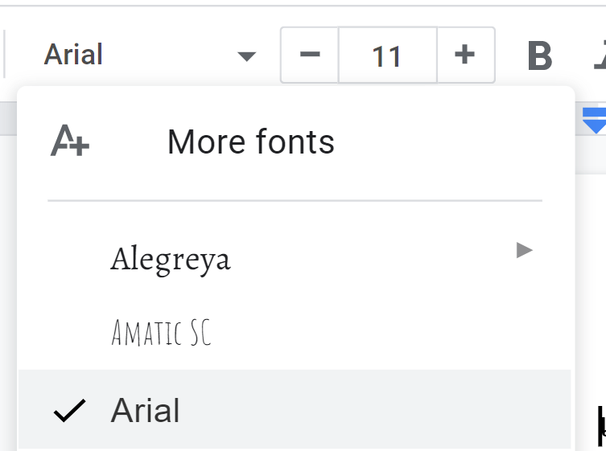
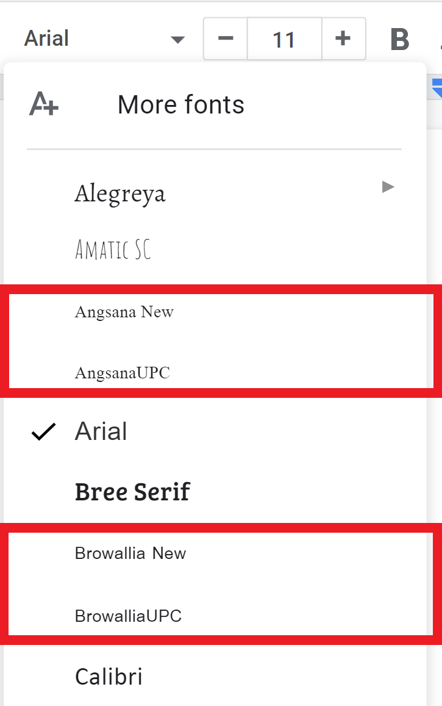

Currently, we can use [Google Fonts](https://fonts.google.com/) in our Google Drive document including Google Docs, Google Sheets, and Google Slides by selecting **More fonts** in the font menu dropdown menu.

However, if we would like to use a local font from our computer, Google only supports [some fonts](#supported-fonts). 🤷

The local fonts is categorized by language and will be available when all these conditions are met:

1. That font is **[supported](#supported-fonts)** by Google.
1. We have [set the document language](#set-the-document-language) to **match** that font.
1. We have that font **installed locally**. If we open the document on another machine that the font is not installed, our document will be formatted weirdly.

After we have completed the setup process, local fonts will be available immediately in the **font dropdown menu 🔽**.

## Set the document language

For Google Docs and Google Slides, **File** top-left menu > **Language**.

For Google Sheets, **File** top-left menu > **Spreadsheet settings** > **General** tab > **Locale**.

## Supported fonts

Here is the list of the supported local fonts by language.

### Any languages

- Arial
- Comic Sans MS
- Courier New
- Georgia
- Impact
- Times New Roman
- Trebuchet MS
- Verdana

### Arabic

- Arabic Typesetting
- Sakkal Majalla
- Simplified Arabic
- Traditional Arabic
- Al Bayan
- Baghdad
- DecoType Naskh
- KufiStandardGK
- Nadeem

### Hindi

- Aparajita
- Kokila
- Mangal
- Utsaah
- Devanagari MT

### Hebrew

- Meiryo
- MS Gothic
- MS Mincho
- MS PGothic
- MS PMincho
- HiraMaruPro-W4
- HiraMinPro-W3
- HiraKakuPro-W3
- HiraMaruProN-W4
- HiraMinProN-W3
- HiraKakuProN-W3

### Japanese

- Meiryo
- MS Gothic
- MS Mincho
- MS PGothic
- MS PMincho
- HiraMaruPro-W4
- HiraMinPro-W3
- HiraKakuPro-W3
- HiraMaruProN-W4
- HiraMinProN-W3
- HiraKakuProN-W3

### Korean

- Batang
- Batangche
- Dotum
- Dotumche
- Gulim
- Gulimche
- Gungsuh
- Malgun Gothic
- GungSeo
- HeadLineA
- PCMyungjo
- Pilgi

### Thai

[See more about Thai font.](../how-to-use-local-thai-fonts-in-google-docs-sheets-slides/)

- Angsana New
- AngsanaUPC
- Browallia New
- BrowalliaUPC
- Cordia New
- CordiaUPC
- DilleniaUPC
- EucrosiaUPC
- FreesiaUPC
- IrisUPC
- JasmineUPC
- KodchiangUPC
- Leelawadee
- LilyUPC
- TH Sarabun PSK
- TH SarabunPSK
- Ayuthaya
- Krungthep
- Sathu
- Silom
- Thonburi
- TH Sarabun OFL

### Chinese (PRC) - 中文（中国）

- SimSun
- SimSun-ExtB
- SimHei
- NSimSun
- Microsoft Yahei
- FangSong
- KaiTi
- Hei
- Heiti SC
- Kai
- STFangsong
- STHeiti
- STKaiti
- STsong

### Chinese (Taiwan) - 中文（台湾）

- PMingLiu
- PMingLiu-ExtB
- MingLiu
- MingLiu-ExtB
- Microsoft JhengHei
- DFKai-SB
- BiauKai
- Heiti TC
- LiHei Pro
- LiSong Pro

### Chinese (Hong Kong) - 中文（香港）

- PMingLiu
- PMingLiu-ExtB
- MingLiu
- MingLiu-ExtB
- Microsoft JhengHei
- DFKai-SB
- BiauKai
- Heiti TC
- LiHei Pro
- LiSong Pro
