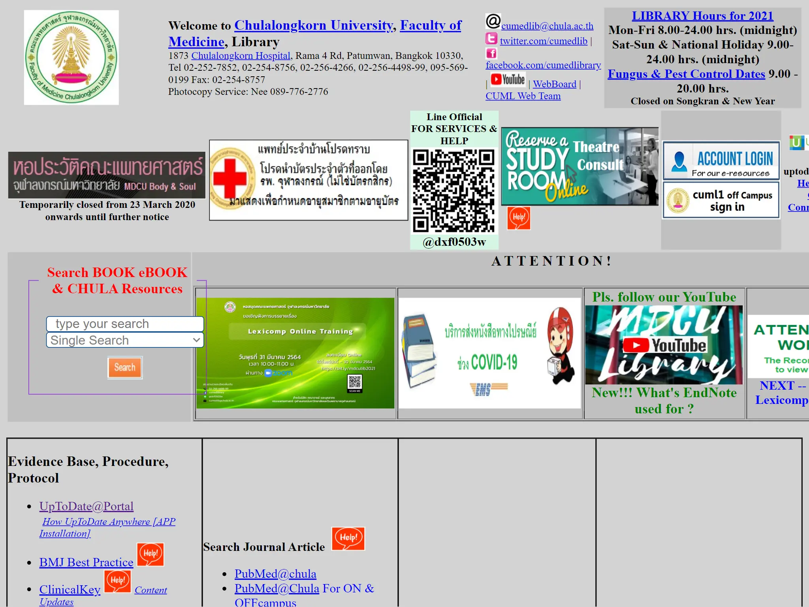
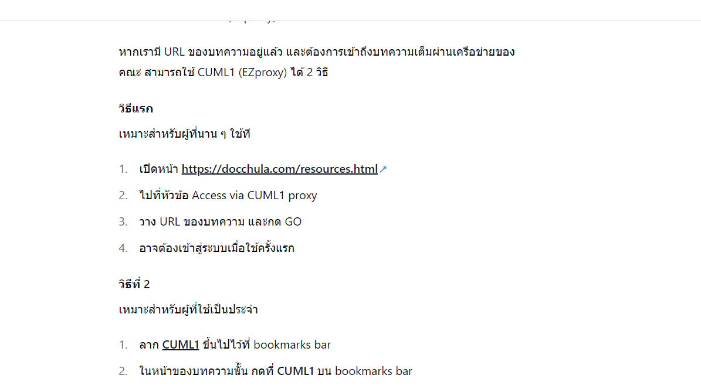

สำหรับ MDCU แล้ว เมื่อต้องการเข้าถึงฐานข้อมูลทางวิชาการ ก็คงต้องเริ่มจาก[เว็บไซต์ห้องสมุด](http://library.md.chula.ac.th) ซึ่งได้รวบรวมบริการต่าง ๆ ที่คณะซื้อไว้

แต่การจะเข้าถึงฐานข้อมูลเหล่านี้และสามารถอ่านบทความได้ จำเป็นต้องเชื่อมต่อจากอินเทอร์เน็ตภายในคณะ ซึ่งเมื่อไม่ได้อยู่บริเวณคณะ แต่ต้องการเข้าถึงบทความ จะสามารถทำให้ตัวเองเหมือนอยู่ที่คณะได้ 2 วิธีหลัก ๆ

## วิธีที่ 1 ใช้ VPN

เป็นการทำให้อินเทอร์เน็ตทั้งหมดภายในเครื่องของเรา วิ่งผ่านไปที่เครือข่ายของคณะก่อน โดยใช้โปรแกรม Cisco AnyConnect ซึ่งสามารถดาวน์โหลด และติดตั้งจาก [สำนักบริหารเทคโนโลยีสารสนเทศ จุฬาลงกรณ์มหาวิทยาลัย](https://www.it.chula.ac.th/service/cunet-vpn-service/) และตั้งค่า address มาที่ `vpn.md.chula.ac.th`

ข้อดีของวิธีการนี้คือ การใช้เครือข่ายของคณะในทุกการเชื่อมต่อ ทำให้มองเห็นเนื้อหาทั้งหมดเหมือนอยู่ที่คณะ รวมทั้งสามารถใช้โปรแกรมลิขสิทธิ์ต่าง ๆ ได้ แต่ก็มีข้อเสียคือ ทำให้คณะสามารถรู้ทุกการเชื่อมต่อของเรา เช่น การใช้งานเว็บไซต์อื่น ๆ หรือทำให้อินเตอร์เน็ตช้าลงเพราะต้องไปเชื่อมต่อผ่านเครือข่ายของคณะ

## วิธีที่ 2 ใช้ CUML1 (EZproxy)

เป็นวิธีการที่เราสามารถเลือกให้เข้าผ่านเครือข่ายของคณะเฉพาะบางเว็บ โดยมีหน้าหลักของระบบอยู่ที่ https://login.cuml1.md.chula.ac.th/ หรือสามารถเข้าได้จากมุมบนขวาของเว็บไซต์ห้องสมุด

เมื่อเข้าผ่านวิธีนี้ ทุกเว็บไซต์จะลงท้ายด้วย `.cuml1.md.chula.ac.th` เป็นการยืนยันว่าเราได้เข้าผ่าน CUML1 (EZproxy)

หากเรามี URL ของบทความอยู่แล้ว และต้องการเข้าถึงบทความเต็มผ่านเครือข่ายของคณะ สามารถใช้ CUML1 (EZproxy) ได้ 2 วิธี

#### วิธีแรก

เหมาะสำหรับผู้ที่นาน ๆ ใช้ที

1. เปิดหน้า https://docchula.com/resources.html
1. ไปที่หัวข้อ Access via CUML1 proxy
1. วาง URL ของบทความ และกด GO
1. อาจต้องเข้าสู่ระบบเมื่อใช้ครั้งแรก

#### วิธีที่ 2

เหมาะสำหรับผู้ที่ใช้เป็นประจำ

1. ลาก <a href="javascript:window.location.href='https://login.cuml1.md.chula.ac.th/login?qurl='+encodeURIComponent(document.location">CUML1</a> ขึ้นไปไว้ที่ bookmarks bar
1. ในหน้าของบทความที่ต้องการ กดที่ **CUML1** บน bookmarks bar
1. อาจต้องเข้าสู่ระบบเมื่อใช้ครั้งแรก
   

ข้อดีของวิธีการนี้คือ เราสามารถเลือกเฉพาะ URL ที่เราต้องการได้ แต่ก็มีข้อเสียคือ สามารถใช้ได้กับเฉพาะเว็บที่คณะเปิดให้เชื่อมต่อผ่านวิธีนี้ อาจเกิดความสับสนระหว่างใช้งานว่าขณะนี้เข้าผ่าน CUML1 (EZproxy) หรือไม่ รวมทั้งไม่สามารถใช้โปรแกรมลิขสิทธิ์ต่าง ๆ ได้
