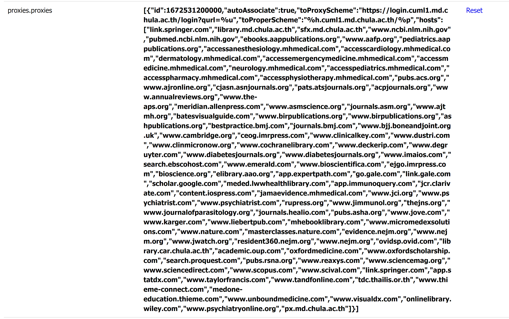

สำหรับ MDCU แล้ว เมื่อต้องการเข้าถึงฐานข้อมูลทางวิชาการ ก็คงต้องเริ่มจาก[เว็บไซต์ห้องสมุด](http://library.md.chula.ac.th) ซึ่งได้รวบรวมบริการต่าง ๆ ที่คณะซื้อไว้

แต่การจะเข้าถึงฐานข้อมูลเหล่านี้และสามารถอ่านบทความได้ จำเป็นต้องเชื่อมต่อจากอินเทอร์เน็ตภายในคณะ ซึ่งเมื่อไม่ได้อยู่บริเวณคณะ แต่ต้องการเข้าถึงบทความ จะสามารถทำให้ตัวเองเหมือนอยู่ที่คณะได้ 2 วิธีหลัก ๆ

## วิธีที่ 1 ใช้ VPN

เป็นการทำให้อินเทอร์เน็ตทั้งหมดภายในเครื่องของเรา วิ่งผ่านไปที่เครือข่ายของคณะก่อน โดยใช้โปรแกรม Cisco AnyConnect ซึ่งสามารถดาวน์โหลด และติดตั้งจาก [สำนักบริหารเทคโนโลยีสารสนเทศ จุฬาลงกรณ์มหาวิทยาลัย](https://www.it.chula.ac.th/service/cunet-vpn-service/) และตั้งค่า address มาที่ `vpn.md.chula.ac.th`

ข้อดีของวิธีการนี้คือ การใช้เครือข่ายของคณะในทุกการเชื่อมต่อ ทำให้มองเห็นเนื้อหาทั้งหมดเหมือนอยู่ที่คณะ รวมทั้งสามารถใช้โปรแกรมลิขสิทธิ์ต่าง ๆ ได้ แต่ก็มีข้อเสียคือ ทำให้คณะสามารถรู้ทุกการเชื่อมต่อของเรา เช่น การใช้งานเว็บไซต์อื่น ๆ หรือทำให้อินเตอร์เน็ตช้าลงเพราะต้องไปเชื่อมต่อผ่านเครือข่ายของคณะ

## วิธีที่ 2 ใช้ CUML1 (EZproxy)

เป็นวิธีการที่เราสามารถเลือกให้เข้าผ่านเครือข่ายของคณะเฉพาะบางเว็บ โดยมีหน้าหลักของระบบอยู่ที่ https://login.cuml1.md.chula.ac.th/ หรือสามารถเข้าได้จากมุมบนขวาของเว็บไซต์ห้องสมุด

ข้อดีของวิธีการนี้คือ เราสามารถเลือกเข้าเฉพาะตอนที่เราต้องการได้ และยังสามารถเข้าเว็บตรงได้อยู่ แต่ก็มีข้อเสียคือ สามารถใช้ได้กับเฉพาะเว็บที่คณะเปิดให้เชื่อมต่อผ่านวิธีนี้ และไม่สามารถใช้โปรแกรมลิขสิทธิ์ต่าง ๆ ได้

เมื่อเข้าผ่านวิธีนี้ ทุกเว็บไซต์จะลงท้ายด้วย `.cuml1.md.chula.ac.th` เป็นการยืนยันว่าเราได้เข้าผ่าน CUML1 (EZproxy)

หากเรามี URL ของบทความอยู่แล้ว และต้องการเข้าถึงบทความเต็มผ่านเครือข่ายของคณะ สามารถใช้ CUML1 (EZproxy) ได้ 3 วิธี

#### วิธีแรก

เหมาะสำหรับผู้ที่นาน ๆ ใช้ที

1. เปิดหน้า https://docchula.com/resources.html
1. ไปที่หัวข้อ Access via CUML1 proxy
1. วาง URL ของบทความ และกด GO
1. จะแสดงหน้าจอเข้าสู่ระบบเมื่อใช้ครั้งแรก

#### วิธีที่ 2

เหมาะสำหรับผู้ที่ใช้งานเป็นครั้ง ๆ หรือ ผู้ที่แชร์ URL ให้คนอื่นบ่อย ๆ

1. ลาก <a href="javascript:window.location.href='https://login.cuml1.md.chula.ac.th/login?qurl='+encodeURIComponent(document.location">CUML1</a> ขึ้นไปไว้ที่ bookmarks bar ตามรูปด้านล่าง
1. ในหน้าของบทความที่ต้องการ กดที่ **CUML1** บน bookmarks bar จากนั้นหน้าบทความนั้นจะเปลี่ยนเป็นการเข้าผ่าน CUML ทันที
1. จะแสดงหน้าจอเข้าสู่ระบบเมื่อใช้ครั้งแรก
   

#### วิธีที่ 3

ใช้ Zotero Connector ช่วย Redirect เหมาะสำหรับผู้ใช้งานเป็นประจำ และแชร์ URL ให้คนอื่นไม่บ่อย

วิธีนี้จะเปลี่ยนทุกเว็บไซต์ที่รองรับให้เป็นการเข้าผ่าน CUML ทันทีทุกครั้ง ถ้าต้องการเข้าโดยตรงไม่ผ่าน CUML เช่น กรณีที่จะแชร์ URL กับคนอื่น ต้องปิด Zotero ก่อน

1. วิธีนี้ต้องติดตั้ง Zotero Connector extension บน browser ก่อน ดาวน์โหลดได้จาก [https://www.zotero.org/download/](https://www.zotero.org/download/) เลือกติดตั้ง Zotero Connector ทางด้านขวา ซึ่งตอนนี้รองรับ Chrome, Edge, Firefox, Safari
1. เข้าไปที่ Preferences ของ Zotero
   - Firefox: คลิกขวาบนปุ่ม Zotero และเลือก Preferences
   - Chrome: คลิกขวาบนปุ่ม Zotero และเลือก Options
   - Safari: คลิกขวาบนหน้าเว็บ และเลือก Zotero Preferences
1. ไปที่หน้า Advanced ส่วน Advanced Configuration ที่อยู่ล่างสุด กดเปิด Config Editor อาจขึ้นคำเตือน ให้กด OK
1. เลื่อนลงไปจนเจอ `proxies.proxies` กดสองครั้งตรงค่าเดิมที่เป็น `[]` และ paste ข้อมูลด้านล่างลงไปแทน หรือ <clipboard-copy value="[{&#34;id&#34;:1672531200000,&#34;autoAssociate&#34;:true,&#34;toProxyScheme&#34;:&#34;https://login.cuml1.md.chula.ac.th/login?qurl=%u&#34;,&#34;toProperScheme&#34;:&#34;%h.cuml1.md.chula.ac.th/%p&#34;,&#34;hosts&#34;:[&#34;link.springer.com&#34;,&#34;library.md.chula.ac.th&#34;,&#34;sfx.md.chula.ac.th&#34;,&#34;www.ncbi.nlm.nih.gov&#34;,&#34;pubmed.ncbi.nlm.nih.gov&#34;,&#34;ebooks.aappublications.org&#34;,&#34;www.aafp.org&#34;,&#34;pediatrics.aappublications.org&#34;,&#34;accessanesthesiology.mhmedical.com&#34;,&#34;accesscardiology.mhmedical.com&#34;,&#34;dermatology.mhmedical.com&#34;,&#34;accessemergencymedicine.mhmedical.com&#34;,&#34;accessmedicine.mhmedical.com&#34;,&#34;neurology.mhmedical.com&#34;,&#34;accesspediatrics.mhmedical.com&#34;,&#34;accesspharmacy.mhmedical.com&#34;,&#34;accessphysiotherapy.mhmedical.com&#34;,&#34;pubs.acs.org&#34;,&#34;www.ajronline.org&#34;,&#34;cjasn.asnjournals.org&#34;,&#34;pats.atsjournals.org&#34;,&#34;acpjournals.org&#34;,&#34;www.annualreviews.org&#34;,&#34;www.the-aps.org&#34;,&#34;meridian.allenpress.com&#34;,&#34;www.asmscience.org&#34;,&#34;journals.asm.org&#34;,&#34;www.ajtmh.org&#34;,&#34;batesvisualguide.com&#34;,&#34;www.birpublications.org&#34;,&#34;www.birpublications.org&#34;,&#34;ashpublications.org&#34;,&#34;bestpractice.bmj.com&#34;,&#34;journals.bmj.com&#34;,&#34;www.bjj.boneandjoint.org.uk&#34;,&#34;www.cambridge.org&#34;,&#34;ceog.imrpress.com&#34;,&#34;www.clinicalkey.com&#34;,&#34;www.dustri.com&#34;,&#34;www.clinmicronow.org&#34;,&#34;www.cochranelibrary.com&#34;,&#34;www.deckerip.com&#34;,&#34;www.degruyter.com&#34;,&#34;www.diabetesjournals.org&#34;,&#34;www.diabetesjournals.org&#34;,&#34;www.imaios.com&#34;,&#34;search.ebscohost.com&#34;,&#34;www.emerald.com&#34;,&#34;www.bioscientifica.com&#34;,&#34;ejgo.imrpress.com&#34;,&#34;bioscience.org&#34;,&#34;elibrary.aao.org&#34;,&#34;app.expertpath.com&#34;,&#34;go.gale.com&#34;,&#34;link.gale.com&#34;,&#34;scholar.google.com&#34;,&#34;meded.lwwhealthlibrary.com&#34;,&#34;app.immunoquery.com&#34;,&#34;jcr.clarivate.com&#34;,&#34;content.iospress.com&#34;,&#34;jamaevidence.mhmedical.com&#34;,&#34;www.jci.org&#34;,&#34;www.psychiatrist.com&#34;,&#34;www.psychiatrist.com&#34;,&#34;rupress.org&#34;,&#34;www.jimmunol.org&#34;,&#34;thejns.org&#34;,&#34;www.journalofparasitology.org&#34;,&#34;journals.healio.com&#34;,&#34;pubs.asha.org&#34;,&#34;www.jove.com&#34;,&#34;www.karger.com&#34;,&#34;www.liebertpub.com&#34;,&#34;mhebooklibrary.com&#34;,&#34;www.micromedexsolutions.com&#34;,&#34;www.nature.com&#34;,&#34;masterclasses.nature.com&#34;,&#34;evidence.nejm.org&#34;,&#34;www.nejm.org&#34;,&#34;www.jwatch.org&#34;,&#34;resident360.nejm.org&#34;,&#34;www.nejm.org&#34;,&#34;ovidsp.ovid.com&#34;,&#34;library.car.chula.ac.th&#34;,&#34;academic.oup.com&#34;,&#34;oxfordmedicine.com&#34;,&#34;www.oxfordscholarship.com&#34;,&#34;search.proquest.com&#34;,&#34;pubs.rsna.org&#34;,&#34;www.reaxys.com&#34;,&#34;www.sciencemag.org&#34;,&#34;www.sciencedirect.com&#34;,&#34;www.scopus.com&#34;,&#34;www.scival.com&#34;,&#34;link.springer.com&#34;,&#34;app.statdx.com&#34;,&#34;www.taylorfrancis.com&#34;,&#34;www.tandfonline.com&#34;,&#34;tdc.thailis.or.th&#34;,&#34;www.thieme-connect.com&#34;,&#34;medone-education.thieme.com&#34;,&#34;www.unboundmedicine.com&#34;,&#34;www.visualdx.com&#34;,&#34;onlinelibrary.wiley.com&#34;,&#34;www.psychiatryonline.org&#34;,&#34;px.md.chula.ac.th&#34;]}]"><span class="text-blue-800 active:text-green-600">กดตรงนี้</span></clipboard-copy> เพื่อ copy
1. เมื่อ paste แล้ว ให้กด OK ปิดเบราว์เซอร์และเปิดใหม่ (หรือปิดเปิดใหม่เฉพาะ Zotero Connector extension)
1. จะแสดงหน้าจอเข้าสู่ระบบเมื่อใช้ครั้งแรก

```json
[
  {
    "id": 1672531200000,
    "autoAssociate": true,
    "toProxyScheme": "https://login.cuml1.md.chula.ac.th/login?qurl=%u",
    "toProperScheme": "%h.cuml1.md.chula.ac.th/%p",
    "hosts": [
      "link.springer.com",
      "library.md.chula.ac.th",
      "sfx.md.chula.ac.th",
      "www.ncbi.nlm.nih.gov",
      "pubmed.ncbi.nlm.nih.gov",
      "ebooks.aappublications.org",
      "www.aafp.org",
      "pediatrics.aappublications.org",
      "accessanesthesiology.mhmedical.com",
      "accesscardiology.mhmedical.com",
      "dermatology.mhmedical.com",
      "accessemergencymedicine.mhmedical.com",
      "accessmedicine.mhmedical.com",
      "neurology.mhmedical.com",
      "accesspediatrics.mhmedical.com",
      "accesspharmacy.mhmedical.com",
      "accessphysiotherapy.mhmedical.com",
      "pubs.acs.org",
      "www.ajronline.org",
      "cjasn.asnjournals.org",
      "pats.atsjournals.org",
      "acpjournals.org",
      "www.annualreviews.org",
      "www.the-aps.org",
      "meridian.allenpress.com",
      "www.asmscience.org",
      "journals.asm.org",
      "www.ajtmh.org",
      "batesvisualguide.com",
      "www.birpublications.org",
      "www.birpublications.org",
      "ashpublications.org",
      "bestpractice.bmj.com",
      "journals.bmj.com",
      "www.bjj.boneandjoint.org.uk",
      "www.cambridge.org",
      "ceog.imrpress.com",
      "www.clinicalkey.com",
      "www.dustri.com",
      "www.clinmicronow.org",
      "www.cochranelibrary.com",
      "www.deckerip.com",
      "www.degruyter.com",
      "www.diabetesjournals.org",
      "www.diabetesjournals.org",
      "www.imaios.com",
      "search.ebscohost.com",
      "www.emerald.com",
      "www.bioscientifica.com",
      "ejgo.imrpress.com",
      "bioscience.org",
      "elibrary.aao.org",
      "app.expertpath.com",
      "go.gale.com",
      "link.gale.com",
      "scholar.google.com",
      "meded.lwwhealthlibrary.com",
      "app.immunoquery.com",
      "jcr.clarivate.com",
      "content.iospress.com",
      "jamaevidence.mhmedical.com",
      "www.jci.org",
      "www.psychiatrist.com",
      "www.psychiatrist.com",
      "rupress.org",
      "www.jimmunol.org",
      "thejns.org",
      "www.journalofparasitology.org",
      "journals.healio.com",
      "pubs.asha.org",
      "www.jove.com",
      "www.karger.com",
      "www.liebertpub.com",
      "mhebooklibrary.com",
      "www.micromedexsolutions.com",
      "www.nature.com",
      "masterclasses.nature.com",
      "evidence.nejm.org",
      "www.nejm.org",
      "www.jwatch.org",
      "resident360.nejm.org",
      "www.nejm.org",
      "ovidsp.ovid.com",
      "library.car.chula.ac.th",
      "academic.oup.com",
      "oxfordmedicine.com",
      "www.oxfordscholarship.com",
      "search.proquest.com",
      "pubs.rsna.org",
      "www.reaxys.com",
      "www.sciencemag.org",
      "www.sciencedirect.com",
      "www.scopus.com",
      "www.scival.com",
      "link.springer.com",
      "app.statdx.com",
      "www.taylorfrancis.com",
      "www.tandfonline.com",
      "tdc.thailis.or.th",
      "www.thieme-connect.com",
      "medone-education.thieme.com",
      "www.unboundmedicine.com",
      "www.visualdx.com",
      "onlinelibrary.wiley.com",
      "www.psychiatryonline.org",
      "px.md.chula.ac.th"
    ]
  }
]
```

ตัวอย่างเมื่อทำการตั้งค่าเสร็จแล้ว



วิธีปิด Zotero Redirect ทำได้สองวิธี คือ ปิด Zotero Connector ไปเลยโดยเข้าไปที่ตั้งค่าของ browser หรือปิดเฉพาะส่วนของ proxy ใน Zotero Connector

1. เข้าไปที่ Preferences ของ Zotero
   - Firefox: คลิกขวาบนปุ่ม Zotero และเลือก Preferences
   - Chrome: คลิกขวาบนปุ่ม Zotero และเลือก Options
   - Safari: คลิกขวาบนหน้าเว็บ และเลือก Zotero Preferences
1. ไปที่หน้า Proxies และติ๊ก `Enable proxy redirection` ออก
