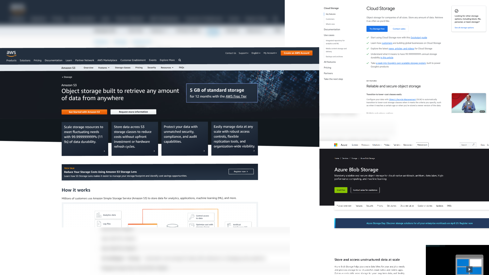
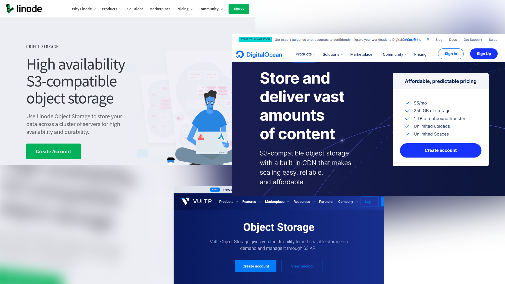
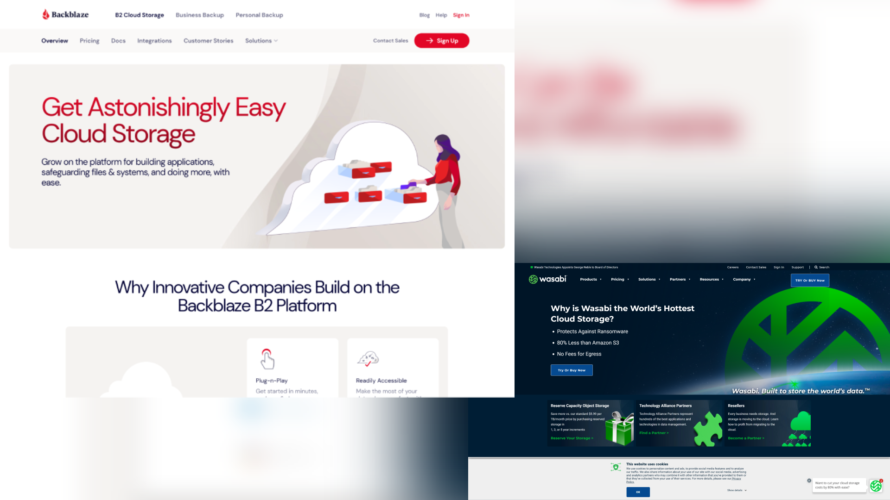

In recent years, many people have stored their valuable data in the cloud. One reason that people adopt cloud solution is their generous free plan on personal accounts. The big player in this space is Google Drive. They offer 15 GB of storage for free. Moreover, students get unlimited storage from their school accounts. Google education and business solutions used to have unlimited storage plans. For business, Google Workspace (previously G Suite) [discontinued its unlimited storage in October 2020](https://9to5google.com/2020/10/08/google-workspace-drive-storage-limits/). For education, there will be a [100 TB per organization limit in July 2022](https://www.blog.google/outreach-initiatives/education/google-workspace-for-education). This change results in a few GBs per user in large universities. People who store their entire data on education account must find a new solution. Although Microsoft OneDrive still provides 1 TB+ storage per user, there is no guarantee that they will not withdraw in the future. The truth is free unlimited data storage is [not a viable business](https://twitter.com/dflieb/status/1326586070264279041).

Despite the data we own are growing every day, [cloud storage providers](https://www.theverge.com/2018/8/31/17796884/cloud-storage-service-google-drive-apple-icloud-microsoft-onedrive-dropbox-box-amazon) still offer the same amount of free storage as a decade ago. Previously free unlimited high-quality photo storage by Google has been [terminated on 1 June 2021](https://blog.google/products/photos/storage-changes/). Moreover, Google Docs, Sheets, Slides, Drawings, Forms, and Jamboard files will be [counted toward your storage usage](https://www.androidpolice.com/2021/04/05/google-is-delaying-when-docs-and-sheets-files-will-start-counting-against-account-storage/) starting on 1 February 2022. Hence, the trick to convert your file to Google Docs to get free storage will break soon. Therefore, in the future, more users must pay for their data warehouse.

Recently, I searched for a system to store my backup data for good. Although consumer clouds like Google Drive, Microsoft OneDrive, Dropbox offer a paid plan, they are suitable for storing short-term and frequently accessed data. They also have a download quota limit which the file may be locked if there are multiple downloads in 24 hours. But for permanent backup, I prefer a more geeky solution like object storage because I can use [the brilliant S3 API](https://aws.amazon.com/s3/storage-launches-infographic/) to manage, access, and share my data through custom scripting and tools like [Rclone](https://rclone.org/).

Here I compare the following S3-compatible object storage providers. Only the links in [the referrals section](#referrals) are affiliated. 🤗

- [AWS S3, Google Cloud, Azure](#aws-s3-google-cloud-azure)
- [DigitalOcean and Linode](#digitalocean-and-linode)
- [Backblaze B2 and Wasabi](#backblaze-b2-and-wasabi)

When considering their pricing, you must look at data storage and inbound/outbound data transfer pricing. Almost every provider has free inbound data transfer to encourage data moving in but not out 😉.

## AWS S3, Google Cloud, Azure

They are the top 3 largest public cloud providers that offer similar object storage plans and have many storage tiers which suit different purposes. Their archival class for long-term data backup have different naming. You can read more information by clicking the link in the table.

| Provider     | Class                                                                                                             | Minimum storage duration | Retrieval period                                                                                                          |
| ------------ | ----------------------------------------------------------------------------------------------------------------- | ------------------------ | ------------------------------------------------------------------------------------------------------------------------- |
| AWS S3       | [Glacier](https://docs.aws.amazon.com/AmazonS3/latest/userguide/storage-class-intro.html#sc-glacier)              | 90 days                  | [5 minutes 5/12 hours](https://docs.aws.amazon.com/AmazonS3/latest/userguide/restoring-objects-retrieval-options.html) |
| AWS S3       | [Glacier Deep Archive](https://docs.aws.amazon.com/AmazonS3/latest/userguide/storage-class-intro.html#sc-glacier) | 180 days                 | [12/48 hours](https://docs.aws.amazon.com/AmazonS3/latest/userguide/restoring-objects-retrieval-options.html)             |
| Google Cloud | [Coldline](https://cloud.google.com/storage/docs/storage-classes#coldline)                                        | 90 days                  | milliseconds                                                                                                              |
| Google Cloud | [Archive](https://cloud.google.com/storage/docs/storage-classes#archive)                                          | 365 days                 | milliseconds                                                                                                              |
| Azure        | [Cool](https://docs.microsoft.com/en-us/azure/storage/blobs/storage-blob-storage-tiers#cool-access-tier)          | 30 days                  | milliseconds                                                                                                              |
| Azure        | [Archive](https://docs.microsoft.com/en-us/azure/storage/blobs/storage-blob-storage-tiers#archive-access-tier)    | 180 days                 | [1/15 hours](https://docs.microsoft.com/en-us/azure/storage/blobs/storage-blob-rehydration)                               |

The table below compares pricing for each provider and class. Besides data storage and outbound transfer, they also charge for API operations and data retrieval. Check details on their official website: [AWS S3](https://aws.amazon.com/s3/pricing/), [Google Cloud](https://cloud.google.com/storage/pricing), [Azure](https://azure.microsoft.com/en-us/pricing/details/storage/blobs/).

|                         |   Storage | Outbound transfer | Data retrieval |
| ----------------------- | --------: | ----------------: | -------------: |
| S3 Glacier              |  $4.00/TB |         $90.00/TB |       $2.50/TB |
| S3 Glacier Deep Archive |  $0.99/TB |         $90.00/TB |       $2.50/TB |
| Google Cloud Coldline   |  $4.00/TB |        $120.00/TB |      $20.00/TB |
| Google Cloud Archive    |  $1.20/TB |        $120.00/TB |      $50.00/TB |
| Azure Cool              | $15.00/TB |         $87.50/TB |      $10.00/TB |
| Azure Archive           |  $0.99/TB |         $87.50/TB |      $20.00/TB |

For convenience, you can use their pricing calculator: [AWS S3](https://calculator.aws/), [Google Cloud](https://cloud.google.com/products/calculator), [Azure](https://azure.microsoft.com/en-us/pricing/calculator/).

AWS S3 Glacier Deep Archive is the lowest cost storage at the moment considering data storage cost alone. The main concern about these providers is 💢 expensive 💢 outbound transfer (egress) when you want to get back your data. Below are more resources about this topic. Although most of them criticize AWS, these apply to all three providers.

- [AWS’s Egregious Egress](https://blog.cloudflare.com/aws-egregious-egress/)
- [NASA to launch 247 petabytes of data into AWS, but forgot about egress costs](https://news.ycombinator.com/item?id=22626097)
- [AWS Customers Rack Up Hefty Bills for Moving Data](https://news.ycombinator.com/item?id=21314412)
- [How cheap can cloud object storage be?](https://simon-80033.medium.com/how-cheap-can-cloud-storage-be-8262c67b48c1)
- [How does CloudFlare themselves afford to give bandwidth for free?](https://news.ycombinator.com/item?id=20791563)
- [Transparency in Cloud Storage Costs: Still Elusive](https://www.backblaze.com/blog/transparency-in-cloud-storage-costs/)
- [Backblaze Cuts B2 Download Price in Half](https://www.backblaze.com/blog/backblaze-b2-drops-download-price-in-half/)

Another attractive public cloud provider is [Oracle](https://www.oracle.com/cloud/storage/pricing.html). Unlike other providers, Oracle gives free 10 TB outbound transfer.

## DigitalOcean and Linode

Smaller cloud providers like [DigitalOcean](https://www.digitalocean.com/products/spaces/), [Linode](https://www.linode.com/products/object-storage/), [Vultr](https://www.vultr.com/products/object-storage/), and [UpCloud](https://upcloud.com/products/object-storage/) provide single class S3-compatible object storage. Their billing is more simple and does not charge for API operations. Their prices are very similar.

| Provider     | Minimum price | Data Storage | Outbound transfer | Additional storage | Additional outbound transfer |
| ------------ | ------------: | -----------: | ----------------: | -----------------: | ---------------------------: |
| DigitalOcean |            $5 |       250 GB |              1 TB |             $20/TB |                       $10/TB |
| Linode       |            $5 |       250 GB |              1 TB |             $20/TB |                       $10/TB |
| Vultr        |            $5 |       250 GB |              1 TB |             $20/TB |                       $10/TB |
| UpCloud      |            $5 |       250 GB |            0.5 GB |             $20/TB |                       $10/TB |

Unlike the pay-as-you-go scheme from the top three providers, they have a minimum charge bundled with initial data storage and outbound transfer quota. Although their single storage class is cheaper than the standard class from top providers, it is more expensive than the above archival classes. Hence, these smaller cloud providers are not suitable for long-term storage.

Another notable provider is Scaleway. Scaleway has [C14 Cold Storage](https://www.scaleway.com/en/c14-cold-storage/) advertised as "World’s first alternative S3 Glacier". C14 Cold Storage stores data in an underground bunker in Paris only. However, the storage is accessible from both Paris and Amsterdam regions. It comes with 75 GB free storage and 75 GB free outbound transfer with an additional of €0.002/GB for storage and €0.01/GB for outbound transfer.

## Backblaze B2 and Wasabi

Unlike the above providers, which mainly sell computing, [Backblaze B2](https://www.backblaze.com/b2/cloud-storage.html) and [Wasabi](https://wasabi.com/) offer only a cloud storage solution. Their overall pricing is reasonable for ageless backup storage and impressively cheaper than those top providers. They do not have a retrieval fee and a delayed retrieval period. Although Wasabi is relatively new, it is recommended by [Stanford University IT](https://uit.stanford.edu/storage/wasabi-cloud-storage). You can read more information by clicking the link in the table.

|                          | Backblaze B2                                                            | Wasabi                                                                           |
| ------------------------ | ----------------------------------------------------------------------- | -------------------------------------------------------------------------------- |
| Minimum price            | -                                                                       | [$5.99](https://wasabi.com/paygo-pricing-faq/#minimum-storage-charge)            |
| Data storage             | [$0.005/GB](https://www.backblaze.com/b2/cloud-storage-pricing.html)    | [$0.0059/GB](https://wasabi.com/cloud-storage-pricing/)                          |
| Outbound transfer        | $0.01/GB                                                                | [Free with conditions](https://wasabi.com/paygo-pricing-faq/#free-egress-policy) |
| Minimum storage duration | -                                                                       | [90 days](https://wasabi.com/paygo-pricing-faq/#minimum-storage-duration)        |
| API operations           | [Limited free](https://www.backblaze.com/b2/b2-transactions-price.html) | -                                                                                |

Backblaze B2 has only US and EU zone, while Wasabi has many regions in the US and Asia. Backblaze B2 users have to select storage location when creating an account and cannot change, whereas Wasabi users can create a bucket in any region.

## Conclusion

|                          | Big cloud             | Smaller cloud | Backblaze B2 | Wasabi       |
| ------------------------ | --------------------- | ------------- | ------------ | ------------ |
| Storage class            | Many archival classes | Single class  | Single class | Single class |
| Data storage             | Less than $5/TB       | $20/TB        | $5/TB        | $5.99/TB     |
| Outbound transfer        | More than $80/TB 💢   | $10/TB        | $10/TB       | No ❌        |
| Minimum storage duration | Yes ✔                 | No ❌         | No ❌        | 90 days      |
| Data retrieval cost      | Yes ✔                 | No ❌         | No ❌        | No ❌        |
| API operations cost      | Yes ✔                 | No ❌         | Yes ✔        | No ❌        |

Backblaze B2 and Wasabi offer a fantastic solution for data hoarders like me. I recommend you to evaluate their pricing strategy and performance yourself. From my experience, Wasabi gives better performance when connecting from the Asia Pacific to the US region.

## More Resources

- [Object Storage Price Comparison by qBackup](https://www.qualeed.com/en/qbackup/cloud-storage-comparison/)
- [10 Best Amazon S3 Alternatives](https://www.coralnodes.com/amazon-s3-alternatives/)
- [Wasabi review](https://www.coralnodes.com/wasabi-storage-review/)
- [DataHoarder reddit community](https://www.reddit.com/r/DataHoarder/)

## Referrals

- [DigitalOcean](https://m.do.co/c/61b92fc0f519) $100, 60-day credit
- [Linode](https://www.linode.com/?r=4c3a05eecf7237278fe445912471f8e51019bee5) $100, 60-day credit
