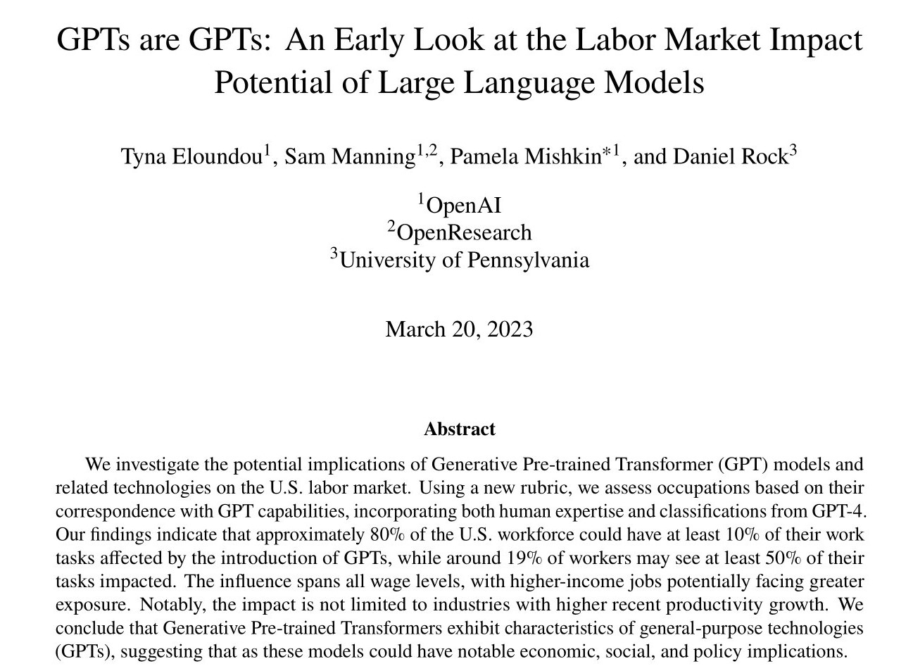
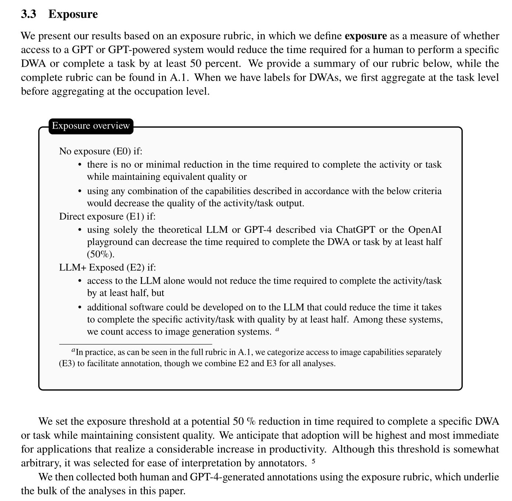
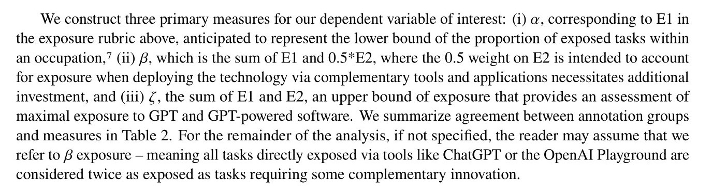
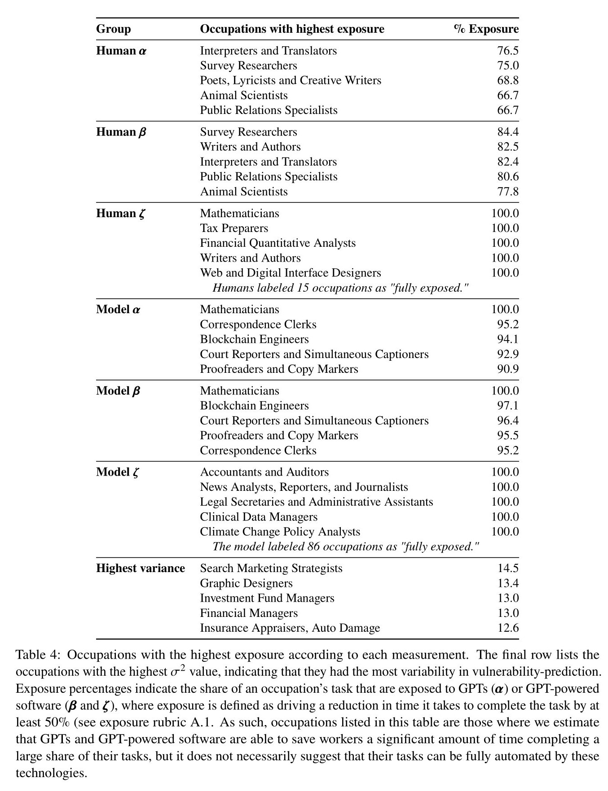
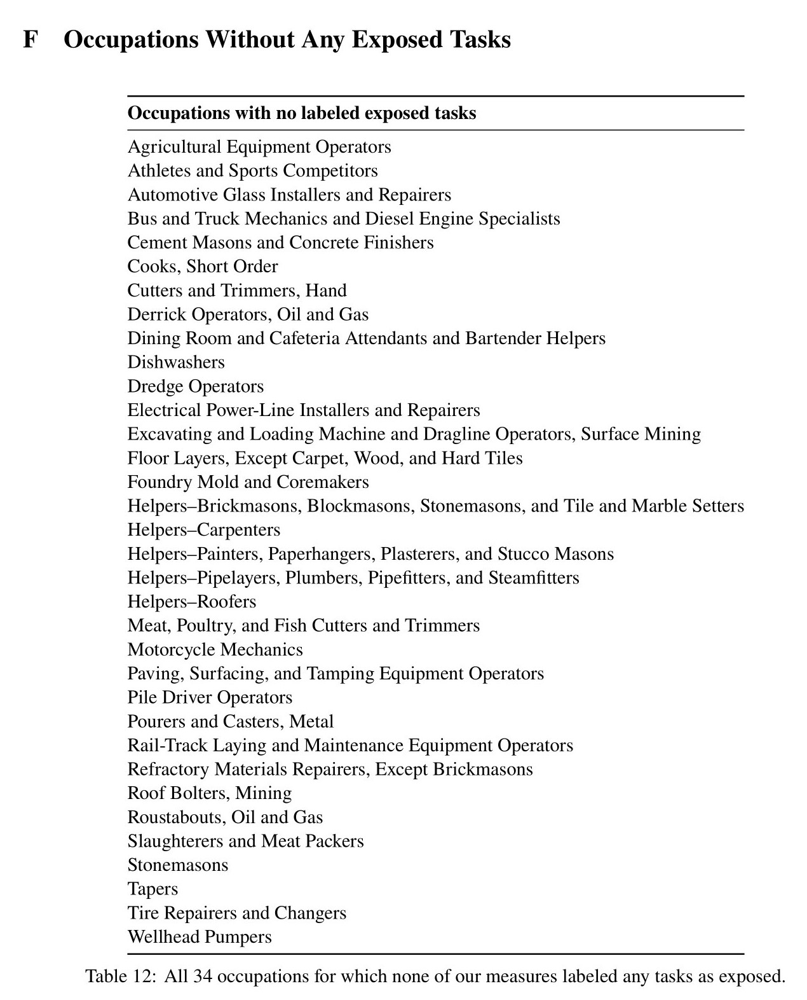

_โพสต์นี้เป็นเนื้อหาเพิ่มเติมจากสรุปที่ได้โพสต์ลง[ทวิตเตอร์](https://twitter.com/ThewDhanat/status/1637846868431634432)_

สรุปประเด็นที่น่าสนใจจากงานวิจัยล่าสุดเกี่ยวกับโมเดลตระกูล GPT รวมทั้ง ChatGPT แต่ยังไม่รวม GPT-4 ถึงผลกระทบต่องานที่ทำ (task) ในแต่ละอาชีพ (occupation) ของคน US โดย OpenAI, OpenResearch และ University of Pennsylvania

[GPTs are GPTs: An Early Look at the Labor Market Impact Potential of Large Language Models](https://arxiv.org/abs/2303.10130)

**หมายเหตุ: ผลกระทบในที่นี้คือใช้ GPT มาช่วยทำงาน ไม่ใช่ทำงานแทน**

## ภาพรวม

- คนประมาณ 80% จะได้รับผลกระทบอย่างน้อย 10% ของงานที่ทำ
- คนประมาณ 19% จะได้รับผลกระทบ 50% ของงานที่ทำ
- GPT จะกลายเป็น General-purpose technologies (GPTs) คือ
  - พัฒนามากขึ้นตามกาลเวลา (improvement over time)
  - มีผลต่อระบบเศรษฐกิจเป็นวงกว้าง (pervasiveness throughout the economy)
  - มีนวัตกรรมต่อยอดเกิดขึ้น (the ability to spawn complementary innovations)

## ข้อมูลเบื้องต้น

- งานวิจัยนี้ใช้ทั้งคนจริง (Human) และ GPT-4 ในการวิเคราะห์ว่าแต่ละงานที่ทำของแต่ละอาชีพ GPT จะเข้ามาช่วยทำงานได้แค่ไหน
- การเข้ามาช่วยทำงาน หมายถึง สามารถลดระยะเวลาการทำงานลง 50% เมื่อใช้เทคโนโลยี GPT หรือ ChatGPT โดยตรง หรือ ใช้โปรแกรมต่อยอดเสริม (โดยให้น้ำหนักความสำคัญกับโปรแกรมต่อยอดเสริมแค่ครึ่งเดียวเทียบกับการใช้เทคโนโลยี GPT หรือ ChatGPT โดยตรง)

## รายละเอียด

อาชีพที่มีโอกาสได้ใช้ GPT มากกว่าเมื่อวิเคราะห์โดยคนจริง (Human) และ GPT-4 (Model)

เมื่อวิเคราะห์เพิ่มเติมพบว่า

- คนที่มีการศึกษาระดับปริญญาตรีขึ้นไป หรือได้เข้าเรียนในระดับวิทยาลัย มีโอกาสได้ใช้ GPT มากกว่า
- อาชีพที่รายได้สูง ไม่ต้องฝึกงานมาก มีโอกาสได้ใช้ GPT มากกว่า
- อาชีพโปรแกรมเมอร์และนักเขียน มีโอกาสได้ใช้ GPT มากกว่า
- อาชีพที่ต้องใช้วิทยาศาสตร์และ critical thinking มีโอกาสได้ใช้ GPT น้อยกว่า
- อาชีพที่รายได้น้อย ต้องฝึกฝนงานนาน มีโอกาสได้ใช้ GPT น้อยกว่า

อาชีพที่น่าจะรอดจากโมเดลตระกูล GPT (ไม่รวมผลจาก AI ในประเภทอื่น เช่น Robotics) ซึ่งเป็นไปตาม Moravec's paradox

- Agricultural Equipment Operators
- Athletes and Sports Competitors
- Automotive Glass Installers and Repairers
- Bus and Truck Mechanics and Diesel Engine Specialists
- Cement Masons and Concrete Finishers
- Cooks, Short Order
- Cutters and Trimmers, Hand
- Derrick Operators, Oil and Gas
- Dining Room and Cafeteria Attendants and Bartender Helpers
- Dishwashers
- Dredge Operators
- Electrical Power-Line Installers and Repairers
- Excavating and Loading Machine and Dragline Operators, Surface Mining
- Floor Layers, Except Carpet, Wood, and Hard Tiles
- Foundry Mold and Coremakers
- Helpers–Brickmasons, Blockmasons, Stonemasons, and Tile and Marble Setters
- Helpers–Carpenters
- Helpers–Painters, Paperhangers, Plasterers, and Stucco Masons
- Helpers–Pipelayers, Plumbers, Pipefitters, and Steamfitters
- Helpers–Roofers
- Meat, Poultry, and Fish Cutters and Trimmers
- Motorcycle Mechanics
- Paving, Surfacing, and Tamping Equipment Operators
- Pile Driver Operators
- Pourers and Casters, Metal
- Rail-Track Laying and Maintenance Equipment Operators
- Refractory Materials Repairers, Except Brickmasons
- Roof Bolters, Mining
- Roustabouts, Oil and Gas
- Slaughterers and Meat Packers
- Stonemasons
- Tapers
- Tire Repairers and Changers
- Wellhead Pumpers

## ความเห็นส่วนตัว

- คนที่มีอาชีพตามที่บทความนี้บอกว่า GPT จะเข้ามาช่วยทำงานมากขึ้น ควรเริ่มศึกษาวิธีใช้ GPT ช่วยในการทำงาน รวมถึงศึกษาข้อจำกัดของมัน
- GPT จะยังไม่เข้ามาทำงานแทน แต่จะเปลี่ยนรูปแบบการทำงาน
- หน่วยงานที่เกี่ยวข้องควรเริ่มออกกฎมาควบคุมการใช้งาน
