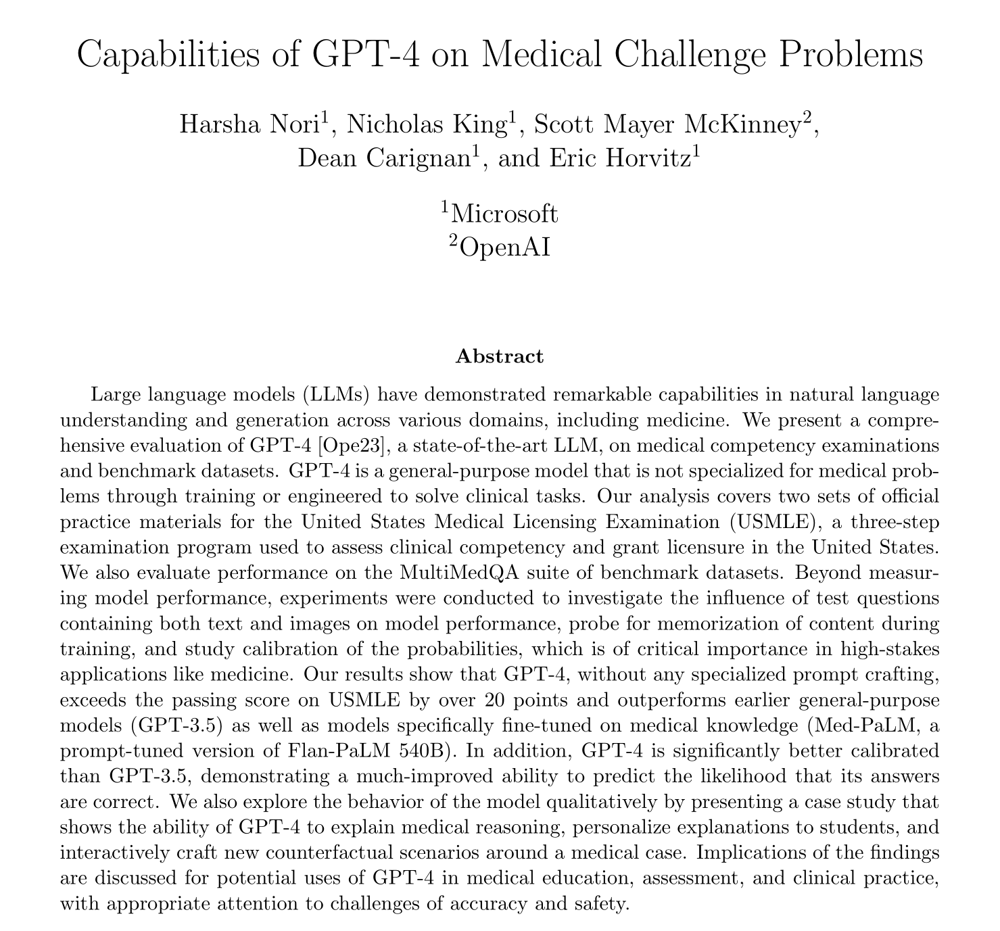
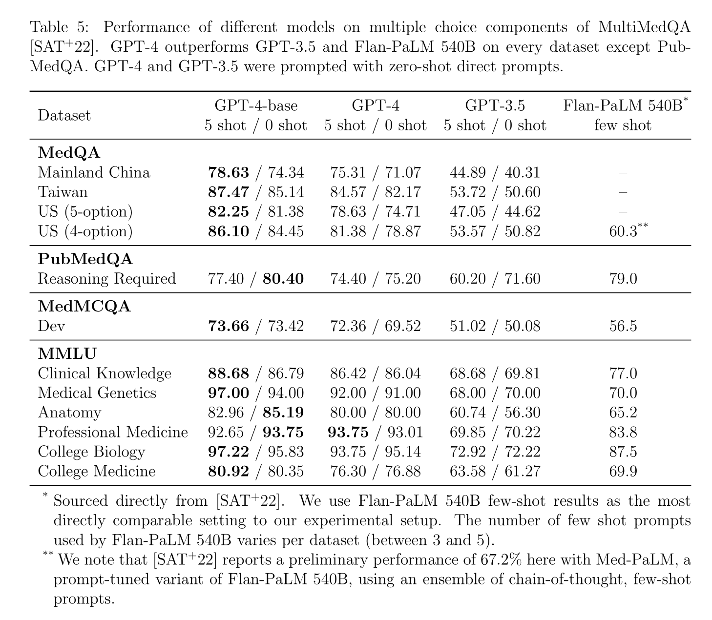

หลังจากที่ GPT-4 เปิดตัวมาไม่นาน OpenAI และ Microsoft ได้เผยแพร่งานวิจัย [Capabilities of GPT-4 on Medical Challenge Problems](https://www.microsoft.com/en-us/research/publication/capabilities-of-gpt-4-on-medical-challenge-problems/) ซึ่งเป็นการทดลองนำ GPT-4 มาตอบข้อสอบแพทย์ โดยก่อนหน้านี้เคยมีงานวิจัยคล้ายกันที่ใช้ [ChatGPT](https://journals.plos.org/digitalhealth/article?id=10.1371/journal.pdig.0000198) ทำให้เรื่องที่ ChatGPT สามารถสอบผ่านข้อสอบแพทย์นี้กลายเป็น[ข่าว](https://www.blognone.com/node/132354)[ดัง](https://www.thedailybeast.com/chatgpt-passed-the-us-medical-licensing-exam-will-it-be-your-future-doctor)ออกมาก่อนหน้านี้แล้ว แต่ในโพสต์นี้เราจะมาดูงานวิจัยล่าสุดนี้กัน

## Brief history

ขอเกริ่นนำด้วยเรื่องงานวิจัยหลัก ๆ ก่อนหน้านี้ที่นำ Large language model มาทำข้อสอบ USMLE
วันที่นี้เรียงตามเวลาที่ปรากฎใน Preprint

- 21 Dec 2022 [Performance of ChatGPT on USMLE: Potential for AI-assisted medical education using large language models](https://journals.plos.org/digitalhealth/article?id=10.1371/journal.pdig.0000198) นำ ChatGPT (GPT-3.5) มาทำข้อสอบ USMLE ซึ่งผลลัพธ์แสดงว่าสามารถทำข้อสอบได้คะแนนประมาณ 60% ซึ่งคาบเส้นที่จะสอบผ่านพอดี
- 26 Dec 2022 [Med-PaLM](https://arxiv.org/abs/2212.13138) โดย Google นำ Flan-PaLM (PaLM ที่ผ่าน Instruction tuning) มาทำ Prompt tuning ทำข้อสอบ MedQA (USMLE) ได้คะแนน 67.6% 
- 14 Mar 2023 [Med-PaLM 2](https://blog.google/technology/health/ai-llm-medpalm-research-thecheckup/) โดย Google อ้างว่าทำข้อสอบได้คะแนน 85% แต่ยังไม่มี paper ออกมา
- 20 Mar 2023 [Capabilities of GPT-4 on Medical Challenge Problems](https://www.microsoft.com/en-us/research/publication/capabilities-of-gpt-4-on-medical-challenge-problems/) คืองานวิจัยที่จะกล่าวถึงในโพสต์นี้

## Overview

- ใช้ GPT-4 ตัวปกติ ที่เป็น text-only (no-vision) โดยไม่ได้ train และ fine-tune เพิ่มเติม
- ไม่ได้ใช้เทคนิค prompting อื่น ๆ เช่น chain-of-thought
  prompting, retrieval augmented generation, ensembling strategies ซึ่งหากลองนำมาใช้อาจจะสามารถเพิ่มคะแนนได้มากขึ้น
- ประเมินผลโดยใช้ชุดข้อมูลทดสอบ 2 ชุดคือ
  - United States Medical Licensing Examination (USMLE) ซึ่งเป็นชุดข้อมูลที่มีเฉพาะในงานวิจัยนี้ โดยนำมาจากชุดข้อสอบตัวอย่างที่อยู่บนเว็บไซต์ ไม่ใช้ชุดข้อสอบและเกณฑ์การตัดสินในการสอบที่มีขึ้นจริง ๆ ในแต่ละปี
  - MultiMedQA เป็นชุดข้อมูลเดิมที่ทำในงานวิจัยของ Med-PaLM ประกอบด้วยหลายภาษา

## Prompt

Template

<pre>
{{'The following are multiple choice questions (with answers) about medical knowledge.
{{few_shot_examples}}
{{context}}**Question:** {{question}} {{answer_choices}} **Answer:**('}}
</pre>

Example (GPT-4’s response is shown in green)

<pre>
The following are multiple choice questions (with answers) about medical knowledge.
**Question**: A 40-year-old woman has had hypercalcemia for 1 year and recently
passed a renal calculus. Serum parathyroid hormone and calcium concentrations are
increased, and serum phosphate concentration is decreased. Parathyroid hormone most
likely causes an increase in the serum calcium concentration by which of the following
mechanisms?
(A) Decreased degradation of 25-hydroxycholecalciferol
(B) Direct action on intestine to increase calcium absorption
(C) Direct action on intestine to increase magnesium absorption
(D) Increased synthesis of 25-hydroxycholecalciferol
(E) Inhibition of calcitonin production
(F) Stimulation of 1,25-dihydroxycholecalciferol production
**Answer:**(F
</pre>

## Results

GPT-4 ทำคะแนนโดยรวมได้ 86% เมื่อเทียบกับ GPT-3.5 ที่ทำได้ประมาณ 53-58%

เนื่องจากในงานนี้ ใช้ GPT-4 แบบ text-only ทำให้มีปัญหากับข้อสอบที่มีรูปภาพ แต่ GPT-4 ก็ยังทำคะแนนได้ 70-80% จากการอ่านเฉพาะข้อสอบส่วนที่เป็นข้อความโดยไม่เห็นรูปภาพ

เมื่อลองให้ GPT-4 อธิบายเหตุผล ก็สามารถอธิบายเหตุผลและหลักการเดาคำตอบเฉพาะจากข้อความที่ทำให้ได้คำตอบที่ถูกต้องได้

เมื่อนำ GPT-4 เทียบกับโมเดลก่อนหน้าโดยใช้ชุดข้อมูลทดสอบ MultiMedQA (ยังไม่รวม Med-PaLM 2 ของ Google ที่ประกาศในเวลาใกล้เคียงกับ GPT-4) พบว่ายังคงทำคะแนนได้ดี
คะแนน Med-PaLM ในตารางนี้คือคะแนนแบบที่ไม่ได้ใช้เทคนิค Prompt tuning

### RLHF กับ Performance

GPT-4 ได้ถูกเทรนด้วย RLHF หลายครั้งก่อนปล่อยออกสู่สาธารณะเพื่อทำให้ GPT-4 "Aligned" หรืออยู่ในลู่ทางที่ควรจะเป็นมากขึ้น เพื่อลดปัญหาด้านความอคติทางเพศ ความรุนแรง คำแนะนำและภาษาที่ไม่เหมาะสม ซึ่งตอนแรก OpenAI กล่าวว่าการทำแบบนี้ไม่มีผลกระทบกับ performance ของ GPT-4 มากนัก แต่ในงานนี้ได้พบว่าเวอร์ชั่นที่ปล่อยออกสู่สาธารณะทำคะแนนได้ลดลง 3-5% ดังแสดงในตารางด้านล่าง GPT-4-base คือก่อน RLHF เพื่อทำ Alignment และ GPT-4 คือเวอร์ชั่นที่ปล่อยออกสู่สาธารณะ

ซึ่งปรากฏการณ์นี้ได้แสดงให้เห็นใน[งาน](https://twitter.com/ben_levinstein/status/1638537047076995072)[อื่น](https://www.thepromptreport.com/p/report-7-openai-took-fun-gpt4)เช่นเดียวกัน

### Calibration

เนื่องจากการนำโมเดลไปใช้งานจริง ต้องให้โมเดลสามารถบอกความน่าจะเป็นในคำตอบของแต่ละข้อได้ โมเดลที่ดีจึงควรบอกความน่าจะเป็นในคำตอบที่เลือกได้ดี เพื่อให้ผู้ใช้สามารถตัดสินใจเชื่อหรือไม่เชื่อโมเดลได้ งานวิจัยนี้ได้ลองทำ Calibration plot เพื่อดูความสัมพันธ์ระหว่างความน่าจะเป็นกับความถูกต้องของคำตอบ และพบว่า GPT-4 มีความสัมพันธ์ที่ดีกว่า GPT-3.5
อย่างไรก็ตามวิธีนี้สามารถใช้ได้กับ multiple-choice question-answering เท่านั้น เพราะสามารถให้โมเดลบอกความน่าจะเป็นของคำตอบที่เลือกออกมาได้ตรง ๆ ถ้าเป็นข้อสอบแบบอื่นจะยังไม่มีวิธีที่บอกความน่าจะเป็นได้ในขณะนี้

## Limitations

### Prompting

ในตอนแรกงานนี้ไม่ได้ใช้เทคนิค Prompting อย่าง chain-of-thought และ few-shot example เพื่อให้ได้ baseline performance แต่จากการทดลองเบื้องต้นเมื่อเพิ่มเทคนิตเหล่านี้พบว่าทำแล้วยังได้คะแนนพอ ๆ เดิม

### Memorization and Leakage

ตั้งแต่ที่ GPT-4 ออกมา ก็ไม่ได้เปิดเผยว่าชุดข้อมูลที่ใช้สอนมีอะไรบ้าง ซึ่งข้อสอบที่ใช้ทดสอบนี้ก็อาจจะอยู่ในชุดข้อมูลที่ใช้สอน ซึ่งเคยมี[คนตั้งข้อสังเกตถึงคะแนนที่สูงผิดปกติ](https://twitter.com/cHHillee/status/1635790330854526981)ไว้แล้วในการทดสอบการเขียนโปรแกรม
ในงานวิจัยนี้ได้ใช้ memorization effects Levenshtein detector (MELD) ในการตรวจหาว่าโมเดลเคยเห็นข้อสอบนี้มาก่อนหรือไม่ แต่ก็ตรวจไม่พบ อย่างไรก็ตาม MELD นี้มี high precision แต่ก็ยังไม่ทราบ recall ดังนั้นการตรวจไม่พบก็ไม่ได้แปลว่าไม่มี

> We stress that this does not mean GPT-4 has not seen this data before, only that we
> are unable to find evidence of it through our blackbox testing method.

### Multiple choice questions

การสอบ USMLE จริง ๆ แล้ว ไม่ได้มีแต่ multiple choice questions แต่ยังมี computer-based case simulations (CCS) ที่ต้องจำลองสถานการณ์โต้ตอบ ซึ่งงานวิจัยนี้ไม่ได้ทดสอบ แต่ได้ทำตัวอย่างแสดงความสามารถของ GPT-4 ที่นำมาช่วยในสถานกาณ์จำลองไว้ ดูเพิ่มเติมที่ Section 7.1 "Beyond Correct Answers: Probing Capabilities"

 

## Real world

งานวิจัยนี้แสดงให้เห็นถึงความสามารถที่จะนำ GPT-4 ไปต่อยอดในหลายด้าน รวมถึงมีอิทธิพลต่อเวชปฏิบัติในอนาคต และมุมมองของแพทย์ต่องานต่าง ๆ ว่างานไหนที่มีความจำเป็นที่ต้องใช้แพทย์จริง ๆ แต่ก็ยังมีข้อผิดพลาดที่ต้องระวังอย่างมาก ซึ่งข้อผิดพลาดเหล่านี้ยังไม่มีวิธีการจัดการที่ชัดเจน เช่น

- highly sensitive to details of the wording of prompts
- inaccurate recommendations about rankings (e.g., with differential diagnoses) and sequencing (e.g., information gathering, testing)
- blatant factual errors หรือ hallucinations
- unfair and harmful to specific groups of people, depending on backgrounds and demographics (bias)

ดังนั้นผู้ที่นำไปใช้ต้องเข้าใจและคอยตรวจสอบยืนยันความถูกต้องของข้อมูลที่ออกมาจาก Large language model เสมอ

สุดท้ายนี้การนำข้อสอบที่ออกแบบมาสำหรับทดสอบมนุษย์[อาจไม่เหมาะสม](https://datasets-benchmarks-proceedings.neurips.cc/paper/2021/hash/084b6fbb10729ed4da8c3d3f5a3ae7c9-Abstract-round2.html)[ที่จะนำมาใช้](https://aisnakeoil.substack.com/p/gpt-4-and-professional-benchmarks)ประเมินโมเดลแบบนี้อีกต่อไป
